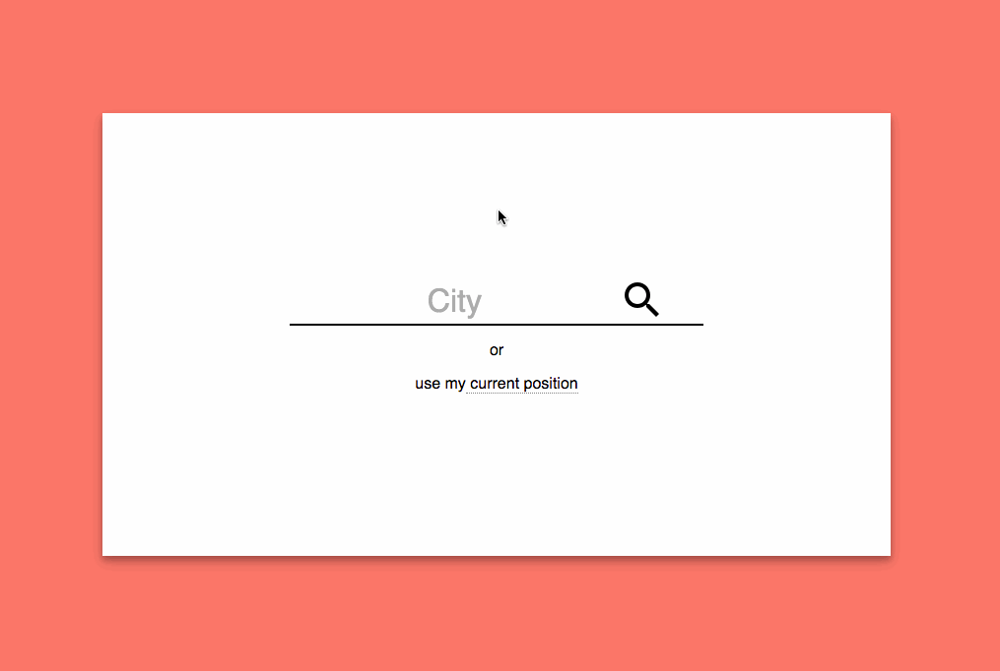

# Weather App

### [Demo](https://majid-weather-app.herokuapp.com/)

## How to run:
  * Run `npm install` to download all dependencies
  * Run `npm start` to start the Express server for production
  * Run `npm run dev` to start the Webpack server

## Technologies Used:
* React
* Redux
* Webpack
* Sass
* svg-sprite

- [X]  Application should provide 7-day (or less if there any API restrictions) forecast starting from today; - City can be selected by name or current geo-coordinates can be used;
- [X] In the list temperature should be shown for a daytime, icons should be neutral;
- [X] In the section "Current weather" the temperature and icon depend on the current time;
- [X] According to changes in control "Scale's type" (C or F) convert temperature from Celsius to Fahrenheit or vice versa;
- [X] If page was reloaded then application should restore state (if any city was selected by name or coordinates, it should be shown saved forecast, but in background, app should ask about new data);
- [X] Make it responsive (suggest your option for mobile)
- [X] The result should be available in a Git repository (on Github or Bitbucket for example)
- [X] We don't have strong requirements about JS frameworks, but we're using React in our project, would be nice to use it for test assignment;
- [X] CSS frameworks shouldn't be used for this test assignment. Preferably use a CSS preprocessor (Stylus, Sass, etc…)
- [X] It should work as single page application. Although this specific task can be done in a more simple way, it is important that you use some package manager and other tools (like task runners or JS transpilers and CSS preprocessors)

### Get Location Page

On this page you can either type your city or you can get your location by clicking on (current position) which is using HTML5 Geolocation API. Clicking or Entering event is available the city input box. Every time you get weather status for your targeted city, the name of the city gets saved into local storage and will be used for your next visit.

### Forecast Page

When you get to this page first you will see a loading animation and current date till the data comes back from api. Then you will see next seven days forecast plus todays weather in detail.
I received temperatures with Kalvin unit and every time you click on the switch on the top right side of the page, I convert the temperature (C or F) on spot. All of the weather icons are imported into the source code using sprite technic to make the app more performant.

### Routing

I used react router package to navigate between two pages. location page is on "/" and forecast page on "/forecast".

### Responsiveness

I used two technic to make this app responsive, which are media query and calc(px + vw). I have tested on phone, tablet, and desktop.

### Video Walkthrough

Here's a walkthrough of implemented user stories:

